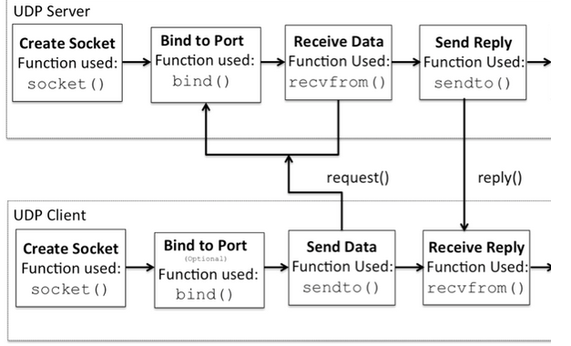
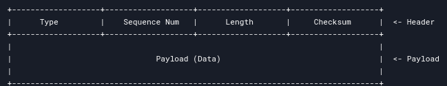

# RTP
 Computer Network Project

### Part 1:
- [x] Send START packet (type 0, seq_num 0) and wait for ACK (type 3, seq_num 1).

- [x] Read input data, split into chunks of 1456 bytes each (since the max packet size is 1472, header is 16 bytes).

- [x] Use a sliding window mechanism. The window size is given as an argument.

- [x] Send packets within the window, track sent packets.

- [x] Handle ACKs from the receiver. For each ACK, update the window base.

- [x] Retransmit packets if ACKs aren't received within 500ms.

- [x] After all DATA packets are sent and ACKed, send END packet (type 1) and wait for its ACK.
- ***Note***:
  - 500ms retransmission timer: resend if no ACK is received
  - Window size: maximum number of unacknowledged packets the sender can transmit before waiting for ACKs
  - 
  - Packet structure:
    