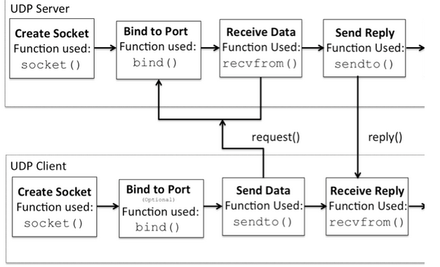
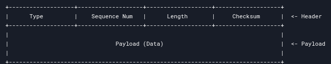

# RTP
Computer Network Project

## My report at [here](report/report.md)

### Part 1:
- [x] Send START packet (type 0, seq_num 0) and wait for ACK (type 3, seq_num 1).

- [x] Read input data, split into chunks of 1456 bytes each (since the max packet size is 1472, header is 16 bytes).

- [x] Use a sliding window mechanism. The window size is given as an argument.

- [x] Send packets within the window, track sent packets.

- [x] Handle ACKs from the receiver. For each ACK, update the window base.

- [x] Retransmit packets if ACKs aren't received within 500ms.

- [x] After all DATA packets are sent and ACKed, send END packet (type 1) and wait for its ACK.
- ***Note***:
  - 500ms retransmission timer: resend if no ACK is received
  - Window size: maximum number of unacknowledged packets the sender can transmit before waiting for ACKs
  - 
  - Packet structure:
    


### Part 2:

- [x] Handle START packet

- [x] Check connection is started (ignore START messages)

- [x] Check sum for each packet

- [x] Packet handling: Sliding window track expected sequence number and buffer within
window
  - [x] Unlike expected: buffer
  - [x] Like expected: in-order deliver
  - [x] Drop all package outsize window
  - [x] Cumulative ACKs

- [x] Exit with END message

 4. **Buffering and In-Order Delivery**: The receiver should buffer out-of-order packets within the window and deliver them in order once the missing packets arrive.

- 5. **Handling END Packet**: Upon receiving an END packet (type 1), send an ACK and terminate after sending the final ACK.


- ***Note***:
  - Handle only one `sender` at a time

### Part 3:
- [x] Modify the receiver to send individual ACKs for each DATA/END packet instead of cumulative ACKs.
- [x] Replace the sliding window logic to track individual ACKs


## Socket

### My checklist
- [x] Build basic socket from book “Computer Networking: A Top-Down Approach, Global Edition, 8th Edition”

- [x] Socket wrapper
  - [x] Sender socket (inspired by sender)
  - [x] Receiver socket (inspired by receiver)
  - [x] [Test](#Testing-receiver-and-sender)

- [x] Client-server program
  - [x] Server side
  - [x] Client side
  - [x] [Test](#Testing-client-and-server)

#### Testing receiver and sender
```sh
cd UDP-RTP
# Receiver
python receiver.py localhost 40000 128 > output.txt

# Proxy
python proxy.py localhost 50000 localhost 40000 0123

# Sender
python sender.py localhost 50000 128 < test_message.txt

# Verify
diff output.txt test_message.txt
```
***Remember*** run them on different bash


#### Testing client and server
```sh
cd UDP-RTP
# Receiver
python rtp_server.py > output.txt

# Sender
python rtp_client.py < test_message.txt

# # Verify
# diff output.txt test_message.txt
```